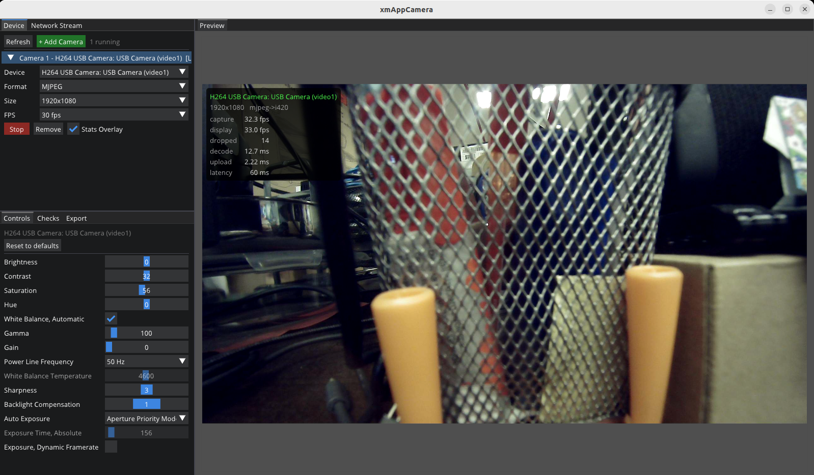

# xmAppCamera

A lightweight, low-latency desktop app to **preview, tune, and record camera sources** — USB cameras and RTSP/UDP network streams — built on the xmotion family (quickviz + xmBase). Frames stay in their native format end-to-end (no OpenCV), with GPU color conversion, for raw performance and a small footprint.



## Features

- **Multi-camera preview** — run several USB cameras and network streams side by side in a tiled, resizable view, with a per-source stats overlay (capture/display fps, drops, decode/upload/latency).
- **Full camera control** — every V4L2 control the camera exposes (exposure, gain, white balance, …) with live tuning, auto/manual dependency handling, and reset to defaults.
- **Config export & reload** — save a camera's format and control state to a YAML file and restore it later, for repeatable deployments.
- **Network streams** — RTSP/UDP sources via a guided pipeline builder or a raw GStreamer pipeline, with automatic reconnect and clear error reporting.
- **Recording** — per-source or synchronized multi-source recording with a shared time base and manifest:
  - **H.264** (default) — compact, universally playable
  - **Passthrough** — the camera's original MJPEG/H.264 bitstream, zero re-encode
  - **FFV1** — lossless
  - **Y4M** — raw frames
- **RTSP re-export** — publish any live source as an RTSP stream (selectable interface, port, and path).
- **Device checks** — built-in qualification suite: exposure/gain lock, AWB disable, disconnect recovery, timestamp sanity, soak test, and more.
- **Robust device handling** — stable identities across reboots and re-plugs (`/dev/v4l/by-path` / `by-id`), hot-plug recovery while streaming.

## Install

Grab the `.deb` from the latest CI artifacts, or build it yourself (see below), then:

```bash
sudo apt install ./xmappcamera_*.deb
```

## Build from source

```bash
# dependencies (Ubuntu)
sudo apt install -y build-essential cmake pkg-config \
  libgl1-mesa-dev libglu1-mesa-dev libglfw3-dev libglm-dev libcairo2-dev \
  libfontconfig1-dev libeigen3-dev libspdlog-dev libfmt-dev libyaml-cpp-dev \
  libgstreamer1.0-dev libgstreamer-plugins-base1.0-dev libgstrtspserver-1.0-dev \
  gstreamer1.0-plugins-base gstreamer1.0-plugins-good gstreamer1.0-plugins-bad \
  gstreamer1.0-plugins-ugly gstreamer1.0-libav

git clone --recursive https://github.com/rxdu/xmAppCamera.git
cd xmAppCamera
cmake -S . -B build -DCMAKE_BUILD_TYPE=RelWithDebInfo
cmake --build build -j"$(nproc)"

./build/bin/xmAppCamera
```

To package: `cd build && cpack -G DEB`.

## Documentation

- [docs/DESIGN.md](docs/DESIGN.md) — architecture, frame path, threading model.
- [docs/adr/](docs/adr/) — key design decisions and rationale.
- [docs/design/config-schema.md](docs/design/config-schema.md) — exported config format.

## License

[Apache License 2.0](LICENSE) — Copyright (c) 2026 Ruixiang Du (rdu)
